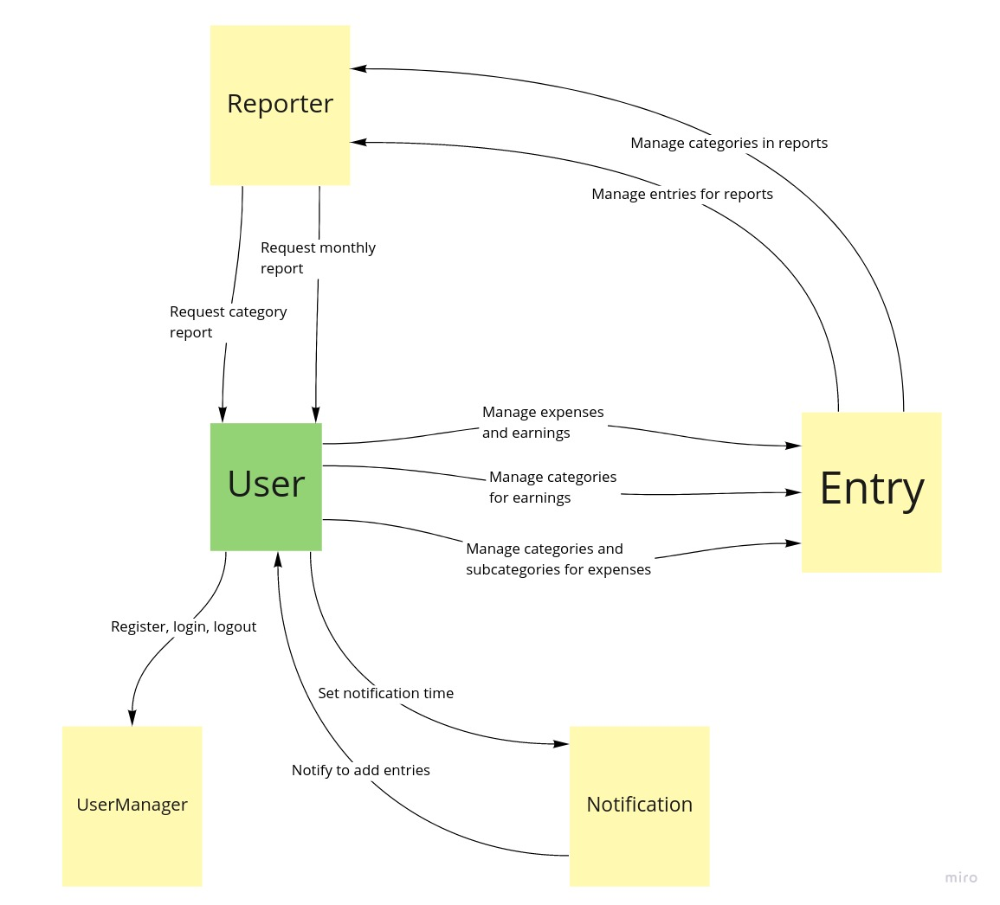
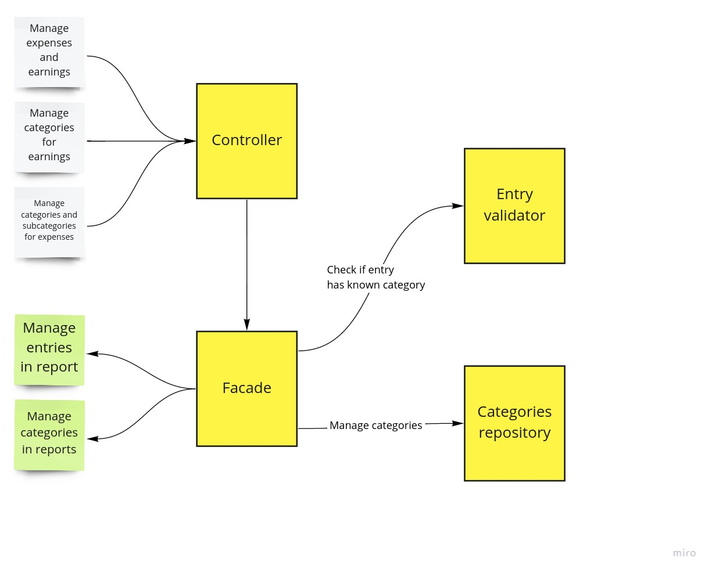
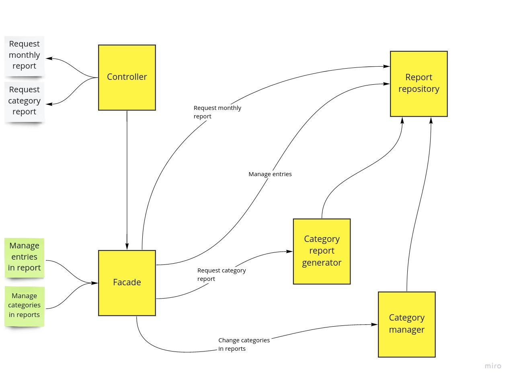

# Requirements

As a user I want to keep track of my expenses and earnings. I should be able to add, modify and delete entries. When I
see them they should be grouped by month. Each expense should have date, amount, category and subcategory. Earnings
should have the same information except for subcategory. I should specify categories and subcategories before adding
entries, so I can select them later. I should have information about total expenses and earnings for given month.

When I don't have time to add expense or earning I want to have option to add a quick expense with a short description,
and then they will show up, so I will remember about filling them.

I want to get notifications that will remind me that I should add entries from today. I am able to switch them on and
off and specify the time that I get them.

I want a detailed view about how much I spend and earn for each category and subcategory.

# Happy path

- I register as a user
- I log in to the application
- I create a category for expenses: Food
- I create a subcategory for "Food": Home
- I create a category for earnings: Work
- In the configuration I set my notifications for 5 pm.
- I get the notification.
- I add expense:
    - Date: 04.05.2021 r.
    - Amount: 20 zł
    - Category: Food
    - Subcategory: Home
    - Description:
- I add expense:
    - Date: 04.02.2021 r.
    - Amount: 20 zł
    - Category: Food
    - Subcategory: Home
    - Description:
- I add earning:
    - Date: 02.05.2021 r.
    - Amount: 40 zł
    - Category: Work
    - Description: Bonus
- I get report for 05.2021 r. and see one expense and one earning
- I modify the earning and set amount to 60 zł
- I get report for 05.2021 r. and see earning with changed amount
- In the report I can see 60 zł total earning and 20 zł total expenses
- In the category report I can see that I spend 20 zł for Food, 20 zł for home food and earn 60 zł from Work

# Modules

- Entry
- Reporter
- Notification
- UserManager

## Entry module

## Reporter module

